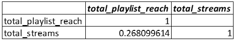
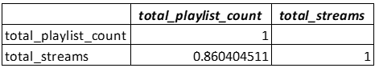

# 2024 Spotify Most-Streamed Songs

## Overview

This project focuses on compiling and analyzing the most-streamed songs on Spotify in 2024. The dataset provides comprehensive insights into track attributes, popularity metrics, and cross-platform presence, serving as a valuable resource for music analysts, enthusiasts, and industry professionals. 
Key details such as track names, artists, release dates, ISRC codes, streaming statistics, and visibility on platforms like YouTube and TikTok are included, enabling in-depth performance analysis and trend identification.

To support this analysis, I developed a database called spotify_project_2024 to systematically organize and process the data. The database includes tables for storing track details, popularity metrics, and platform-specific statistics for services such as Spotify, YouTube, TikTok, Deezer, Pandora, and others. 
These tables are interconnected using unique identifiers like Track ID and ISRC, ensuring data consistency and facilitating seamless queries. 
I loaded the dataset into the database using the COPY command, preparing it for detailed analysis and insights. See code: [Spotify_Songs 2024.csv](./spotify_project.sql)

## Objectives

The primary objectives of this project are:
- Examine the performance of songs listed across all streaming platforms.
- Measure the total potential audience size of the playlists and its relationship with total streams
- Measure the total playlist the song is included in and the relationship between playlist count and total streams.
- Examine the relationship between total engagement and streams accros all platforms

## Dataset Details

The dataset includes:
-	Track Name: Name of the song.
-	Album Name: Name of the album the song belongs to.
-	Artist: Name of the artist(s) of the song.
-	Release Date: Date when the song was released.
-	ISRC: International Standard Recording Code for the song.
-	All Time Rank: Ranking of the song based on its all-time popularity.
-	Track Score: Score assigned to the track based on various factors.
-	Spotify Streams: Total number of streams on Spotify.
-	Spotify Playlist Count: Number of Spotify playlists the song is included in.
-	Spotify Playlist Reach: Reach of the song across Spotify playlists.
-	Spotify Popularity: Popularity score of the song on Spotify.
-	YouTube Views: Total views of the song's official video on YouTube.
-	YouTube Likes: Total likes on the song's official video on YouTube.
-	TikTok Posts: Number of TikTok posts featuring the song.
-	TikTok Likes: Total likes on TikTok posts featuring the song.
-	TikTok Views: Total views on TikTok posts featuring the song.
-	YouTube Playlist Reach: Reach of the song across YouTube playlists.
-	Apple Music Playlist Count: Number of Apple Music playlists the song is included in.
-	AirPlay Spins: Number of times the song has been played on radio stations.
-	SiriusXM Spins: Number of times the song has been played on SiriusXM.
-	Deezer Playlist Count: Number of Deezer playlists the song is included in.
-	Deezer Playlist Reach: Reach of the song across Deezer playlists.
-	Amazon Playlist Count: Number of Amazon Music playlists the song is included in.
-	Pandora Streams: Total number of streams on Pandora.
-	Pandora Track Stations: Number of Pandora stations featuring the song.
-	Soundcloud Streams: Total number of streams on Soundcloud.
-	Shazam Counts: Total number of times the song has been Shazamed.
-	Explicit Track: Indicates whether the song contains explicit content.

## Tools I Used
- **SQL:** Used to load and query data from my locale database
- **Excel:** This was used to carryout simple correlation analysis 
- **PostgreSQL:** For database management

## Analysis
**1. Examine the performance of songs listed across all streaming platforms;**
To gain a comprehensive understanding of song performance across various platforms, 
this analysis focused on examining the top and bottom songs based on streaming data from three major platforms: SoundCloud, Pandora, and Spotify. 
This approach aimed to identify platform-specific trends and assess the competitive advantages of music artists across different streaming services.

```sql
SELECT track_info.Track_ID, track_info.Artist, track_info.Track,
    spotify_metrics.Spotify_Streams, track_info.Explicit_Track
FROM track_info 
INNER JOIN spotify_metrics ON track_info.Track_ID = spotify_metrics.Track_ID
WHERE Explicit_Track is TRUE
AND spotify_streams IS NOT NULL
ORDER BY Spotify_Streams DESC;
```
Blinding Lights by The Weeknd has the highest total streams (4,799,427,953). This track outperforms all others, driven primarily by its dominance on Spotify (4.28 billion streams) While Demons by Imagine Dragons dominates on Pandora with over 1 billion streams, and a total streams of about 3.4billion across the three platforms and Lucid Dreams by Juice WRLD had a fair advantage compare to all other artist on sounclould.


On the other hand " by ALPHA 9 had the lowest overall stream count, with only 98,096 streams combined. "Miracle (Extended)" by Calvin Harris showed a significant disparity, performing well on Spotify but poorly on SoundCloud and Pandora. Interestingly, "I Am Not Okay" by Jelly Roll achieved a substantial number of streams on Pandora, suggesting a strong following on that platform.

**2. Total playlist reach of top performing tracks with the highest streams;**

This query aims to gather the total number of playlist reach so as to determine how widely the song was exposed to listeners on various non-social media platforms—Deezer, Spotify, and YouTube. This measures the total potential audience size of the playlists. 

In this SQL code, I analyzed music track performance by combining data from multiple streaming platforms. First, I calculated each track's total streams across SoundCloud, Pandora, and Spotify by summing their metrics while ensuring no missing values. Then, I calculated the total playlist reach by summing reach metrics from Deezer, Spotify, and YouTube, again filtering out incomplete data. Finally, I joined these two results to create a comprehensive dataset that includes each track's total streams, playlist reach metrics, and overall playlist reach, sorted by total streams in descending order to highlight the top-performing tracks.

```sql
WITH all_streams AS (
    SELECT ti.Track_ID, ti.track, ti.Artist,
        (opm.Soundcloud_Streams + pm.pandora_streams + sm.spotify_streams) AS 
        Total_Streams
    FROM track_info AS ti
    INNER JOIN other_platform_metrics AS opm ON ti.track_id = opm.track_id
    INNER JOIN pandora_metrics AS pm ON ti.track_id = pm.track_id
    INNER JOIN spotify_metrics AS sm ON ti.track_id = sm.track_id
    WHERE ti.Artist IS NOT NULL
    AND opm.soundcloud_streams IS NOT NULL
    AND pm.pandora_streams IS NOT NULL
    AND sm.spotify_streams IS NOT NULL
    ORDER BY total_streams DESC

), total_reach AS(
    SELECT ti.track_id, ti.track, ti.Artist, dm.Deezer_Playlist_Reach,
        sm.Spotify_Playlist_Reach, yt.YouTube_Playlist_Reach,
        (dm.Deezer_Playlist_Reach + sm.Spotify_Playlist_Reach + 
        yt.YouTube_Playlist_Reach) AS total_Playlist_reach
    FROM track_info AS ti
    INNER JOIN deezer_metrics AS dm ON ti.track_id = dm.track_id
    INNER JOIN spotify_metrics AS sm ON ti.track_id = sm.track_id
    INNER JOIN youtube_metrics AS yt ON ti.track_id = yt.track_id
    WHERE dm.Deezer_Playlist_Reach IS NOT NULL
        AND sm.Spotify_Playlist_Reach IS NOT NULL
        AND yt.YouTube_Playlist_Reach IS NOT NULL
    ORDER BY total_Playlist_reach DESC
)

SELECT total_reach.*, all_streams.Total_Streams
FROM total_reach
INNER JOIN all_streams ON total_reach.track_id = all_streams.track_id
ORDER BY all_streams.total_streams DESC;
```

This dataset highlights the playlist reach and total streams for various artists across Deezer, Spotify, and YouTube. 
The Kid LAROI leads in total playlist reach with over 4.4 billion, driven primarily by his exceptional performance on YouTube (4.3 billion). 
Similarly, Tones And I has a strong YouTube presence, contributing to her impressive playlist reach of 2.5 billion. In contrast, The Weeknd  and Ed Sheeran dominate in total streams, with 4.8 billion and 4.7 billion, respectively, reflecting their consistent popularity across platforms, particularly Spotify and YouTube. 
Despite Deezer's low contribution to playlist reach, Spotify and YouTube emerge as key platforms influencing an artist's overall performance.


The correlation coefficient between total playlist reach and total streams is approximately 0.27, indicating a weak positive relationship. This suggests that high playlist reach doesn't always guarantee equivalent streaming success, pointing to the importance of audience loyalty, listener engagement, platform-specific popularity, repeat plays, and marketing efforts likely play a critical role in driving streams. 



Overall, YouTube's dominance in playlist reach and Spotify's strong contribution to streams make them essential platforms for artist success.

**3. Total playlist count of top performing tracks with the highest streams:**

```sql
WITH all_streams AS (
    SELECT ti.Track_ID, ti.track, ti.Artist,
        (opm.Soundcloud_Streams + pm.pandora_streams + sm.spotify_streams) AS 
        Total_Streams
    FROM track_info AS ti
    INNER JOIN other_platform_metrics AS opm ON ti.track_id = opm.track_id
    INNER JOIN pandora_metrics AS pm ON ti.track_id = pm.track_id
    INNER JOIN spotify_metrics AS sm ON ti.track_id = sm.track_id
    WHERE ti.Artist IS NOT NULL
    AND opm.soundcloud_streams IS NOT NULL
    AND pm.pandora_streams IS NOT NULL
    AND sm.spotify_streams IS NOT NULL
    ORDER BY total_streams DESC

), total_count AS(
    SELECT ti.track_id, ti.track, ti.Artist, dm.deezer_playlist_count,
        sm.Spotify_Playlist_Count, opm.apple_music_playlist_count,
        opm.amazon_playlist_count,
        (dm.deezer_playlist_count + sm.Spotify_Playlist_Count + opm.apple_music_playlist_count
         + opm.amazon_playlist_count) AS total_Playlist_count
    FROM track_info AS ti
    INNER JOIN deezer_metrics AS dm ON ti.track_id = dm.track_id
    INNER JOIN spotify_metrics AS sm ON ti.track_id = sm.track_id
    INNER JOIN other_platform_metrics AS opm ON ti.track_id = opm.track_id
    WHERE dm.deezer_playlist_count IS NOT NULL
        AND sm.Spotify_Playlist_Count IS NOT NULL
        AND opm.apple_music_playlist_count IS NOT NULL
        AND opm.amazon_playlist_count IS NOT NULL
    ORDER BY total_Playlist_count DESC
)

SELECT total_count.*, all_streams.Total_Streams
FROM total_count
INNER JOIN all_streams ON total_count.track_id = all_streams.track_id
ORDER BY all_streams.total_streams DESC;
```

The query aims to investigate the relationship between streaming popularity and playlist inclusion and also identify the total playlist counts of the top streamed songs. 

Here is a top 10 list
| track_id | track                         | artist              | deezer_playlist_count | spotify_playlist_count | apple_music_playlist_count | amazon_playlist_count | total_playlist_count | total_streams      |
|----------|-------------------------------|---------------------|------------------------|-------------------------|----------------------------|------------------------|----------------------|--------------------|
| trk56    | Blinding Lights              | The Weeknd          | 564                    | 590,392                 | 859                        | 184                    | 591,999              | 4,799,427,953      |
| trk54    | Shape of You                 | Ed Sheeran          | 512                    | 316,378                 | 465                        | 115                    | 317,470              | 4,721,173,764      |
| trk263   | Starboy                      | The Weeknd          | 118                    | 366,133                 | 341                        | 67                     | 366,659              | 3,646,169,638      |
| trk119   | Believer                     | Imagine Dragons      | 118                    | 335,880                 | 226                        | 71                     | 336,295              | 3,623,749,068      |
| trk40    | Dance Monkey                 | Tones And I         | 584                    | 375,201                 | 549                        | 121                    | 376,455              | 3,481,938,469      |
| trk852   | Demons                       | Imagine Dragons      | 88                     | 263,640                 | 70                         | 29                     | 263,827              | 3,384,936,132      |
| trk27    | STAY (with Justin Bieber)    | The Kid LAROI       | 166                    | 451,732                 | 513                        | 128                    | 452,539              | 3,340,225,421      |
| trk816   | Sweater Weather              | The Neighbourhood   | 114                    | 415,650                 | 189                        | 9                      | 415,962              | 3,303,512,892      |
| trk486   | Let Her Go                   | Passenger           | 12                     | 84,884                  | 153                        | 14                     | 85,063               | 3,302,263,913      |
| trk150   | Lucid Dreams                 | Juice WRLD          | 54                     | 339,306                 | 153                        | 36                     | 339,549              | 3,065,249,446      |


The dataset strongly highlights Spotify's dominance in playlist inclusions for the selected tracks, but it also suggests a potential underrepresentation of other streaming platforms like Deezer, Apple Music, and Amazon Music. For example, "Blinding Lights" by The Weeknd has 590,392 Spotify playlists compared to only 564 on Deezer and 859 on Apple Music. The stark difference may indicate not only Spotify's influence but also the possibility that data from other platforms is incomplete or not equally comprehensive.



The correlation coefficient of 0.86 between total playlist count and total streams indicates a strong positive relationship. This means that as the number of playlists a song is added to increases, the total number of streams also tends to increase significantly. The high correlation suggests that playlist inclusion is a key driver of streaming performance.

**4. Social media Engagement**

This query aims to analyze and rank music tracks by combining data on their streaming performance and audience engagement across multiple platforms. 
It calculates total engagement by summing metrics from TikTok (likes, posts, and views) and YouTube (likes and views) for each track and computes total streams by aggregating metrics from SoundCloud, Pandora, and Spotify.
The results are joined to create a comprehensive dataset that includes each track's total streams and total engagement, filtered to exclude incomplete data and sorted by total streams in descending order to highlight the most popular and engaging tracks.

```sql
WITH engagement AS (
    SELECT tk.*, yt.YouTube_Likes, yt.YouTube_Views, 
        (tk.tiktok_likes + tk.tiktok_posts + tk.tiktok_views +
        yt.youtube_likes + yt.youtube_views) AS total_engagement
    FROM ticktok_metrics AS tk
    INNER JOIN youtube_metrics AS yt ON tk.track_id = yt.track_id

), all_streams AS (
    SELECT ti.Track_ID, ti.track, ti.Artist,
        (opm.Soundcloud_Streams + pm.pandora_streams + sm.spotify_streams) AS 
        Total_Streams
    FROM track_info AS ti
    INNER JOIN other_platform_metrics AS opm ON ti.track_id = opm.track_id
    INNER JOIN pandora_metrics AS pm ON ti.track_id = pm.track_id
    INNER JOIN spotify_metrics AS sm ON ti.track_id = sm.track_id
    WHERE ti.Artist IS NOT NULL
    AND opm.soundcloud_streams IS NOT NULL
    AND pm.pandora_streams IS NOT NULL
    AND sm.spotify_streams IS NOT NULL
    ORDER BY total_streams DESC
)

SELECT all_streams.*, engagement.total_engagement
FROM engagement
INNER JOIN all_streams ON engagement.track_id = all_streams.track_id
WHERE engagement.* is NOT NULL
AND all_streams.* IS NOT NULL
ORDER BY total_streams DESC;
```

| track_id | track                         | artist              | total_streams      | total_engagement    |
|----------|-------------------------------|---------------------|--------------------|---------------------|
| trk56    | Blinding Lights              | The Weeknd          | 4,799,427,953      | 4,685,282,362       |
| trk54    | Shape of You                 | Ed Sheeran          | 4,721,173,764      | 10,577,314,810      |
| trk263   | Starboy                      | The Weeknd          | 3,646,169,638      | 3,273,428,308       |
| trk119   | Believer                     | Imagine Dragons      | 3,623,749,068      | 10,872,637,418      |
| trk40    | Dance Monkey                 | Tones And I         | 3,481,938,469      | 9,659,784,797       |
| trk852   | Demons                       | Imagine Dragons      | 3,384,936,132      | 2,073,112,173       |
| trk27    | STAY (with Justin Bieber)    | The Kid LAROI       | 3,340,225,421      | 27,238,489,338      |
| trk816   | Sweater Weather              | The Neighbourhood   | 3,303,512,892      | 4,903,993,400       |
| trk486   | Let Her Go                   | Passenger           | 3,302,263,913      | 4,203,925,341       |
| trk150   | Lucid Dreams                 | Juice WRLD          | 3,065,249,446      | 1,380,942,467       |

The data reveals that songs with high total streams also exhibit varying levels of total engagement, suggesting differing audience interaction dynamics. For instance, while "Blinding Lights" by The Weeknd has the highest streams (4.8 billion), its engagement (4.6 billion) is relatively aligned. On the other hand, "Shape of You" by Ed Sheeran has nearly as many streams (4.7 billion) but much higher engagement (10.5 billion), indicating significant audience interaction beyond just listening. Similarly, "Believer" by Imagine Dragons and "Dance Monkey" by Tones And I show strong engagement relative to their streams, while "Lucid Dreams" by Juice WRLD exhibits lower engagement compared to its streams.

This variability suggests that certain tracks may resonate with listeners differently, prompting more extensive interactions like shares, likes, or comments, highlighting the importance of analyzing engagement alongside streams to fully understand a song’s impact.


The correlation coefficient of 0.37 between total streams and total engagement indicates a weak to moderate positive relationship, meaning that as engagement (such as likes, shares, or comments) increases, streams also tend to rise, but the relationship is not particularly strong. 
This suggests that while engagement may have some influence on streams, it is not the primary driver, and other factors like playlist inclusions, marketing campaigns

## insights
Interestingly, some artists achieve high stream counts despite lower playlist reach. For instance, Passenger and Juice WRLD convert their modest playlist reach into substantial streams, indicating strong listener engagement or repeat plays. 
Also, a higher number of playlists featuring a song is strongly associated with a higher number of total streams for that song. 

Essentially, the more playlists a song appears on, the more likely it is to be streamed frequently.
This implies that playlist placements are a significant factor in driving a song's streaming success, highlighting the importance of playlist marketing strategies for artists and record labels.

Lastly, the analysis revels that there is a week but positive relationship between total streams and social meadia engagement.
This suggests that while engagement may have some influence on streams, it is not the primary driver, and other factors like playlist inclusions, marketing campaigns

This weak correlation between social media engagement and total streams suggests that social media activity alone is not the primary driver of streaming success. Instead, other factors, such as playlist inclusions, targeted marketing campaigns, radio play, and even the song's genre or popularity trends, tend to play a more significant role in influencing streams.
However, it is worth noting that social media engagement still holds value as a complementary tool. It helps generate buzz around a song, builds a connection with the audience, and provides opportunities for viral moments that can indirectly lead to higher streams.

## Acknowledgments
Nidula Elgiriyewithana. (2024). Most Streamed Spotify Songs 2024 [Data set]. Kaggle. https://doi.org/10.34740/KAGGLE/DSV/8700156

